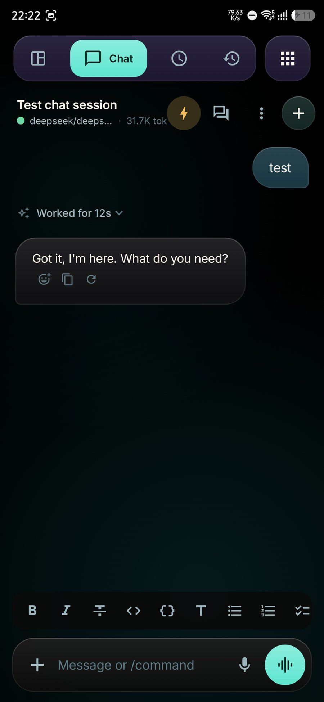
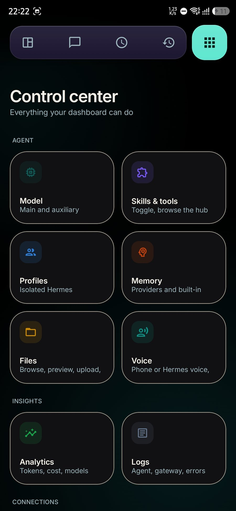
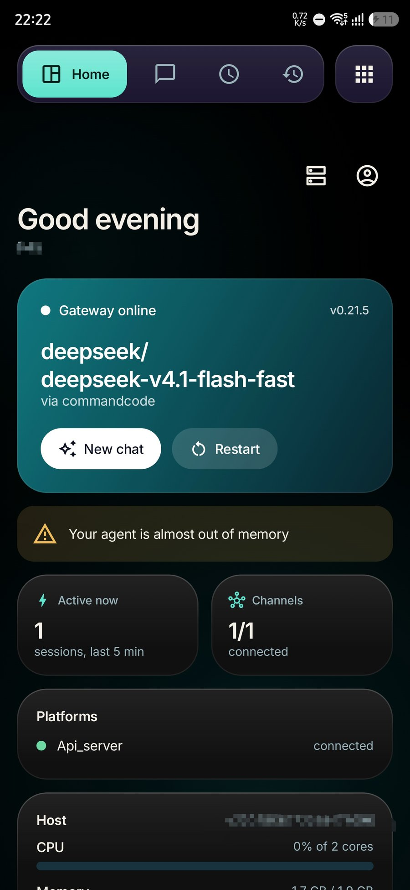
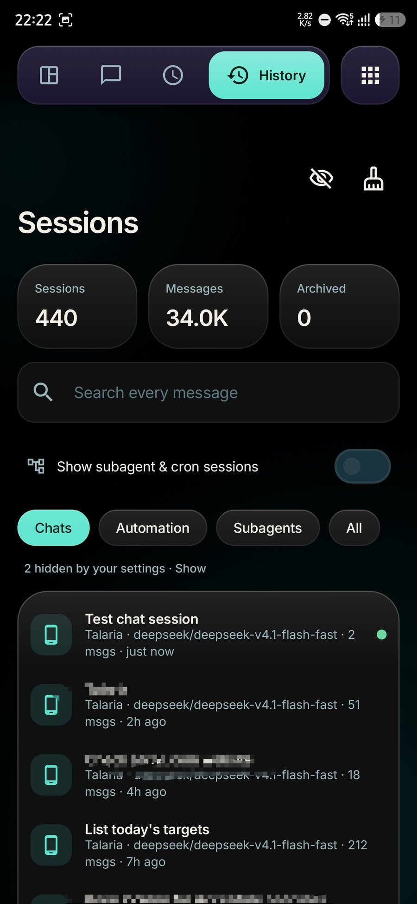
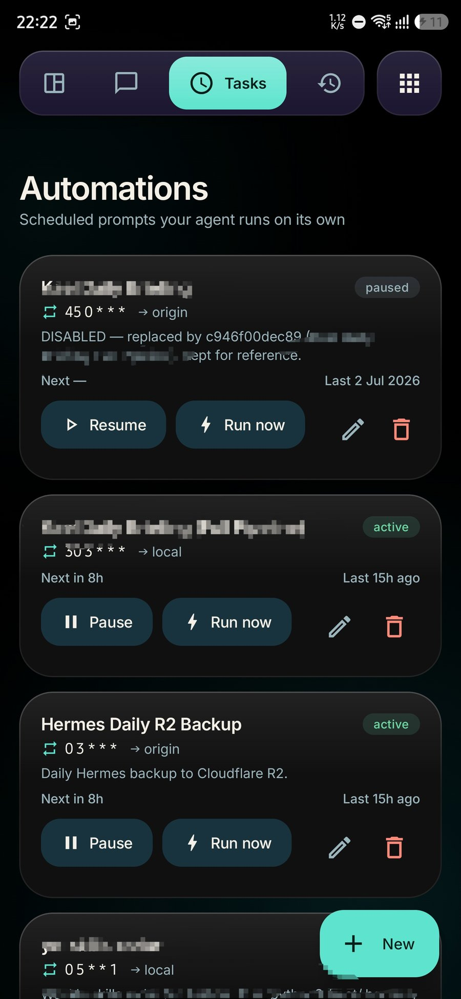
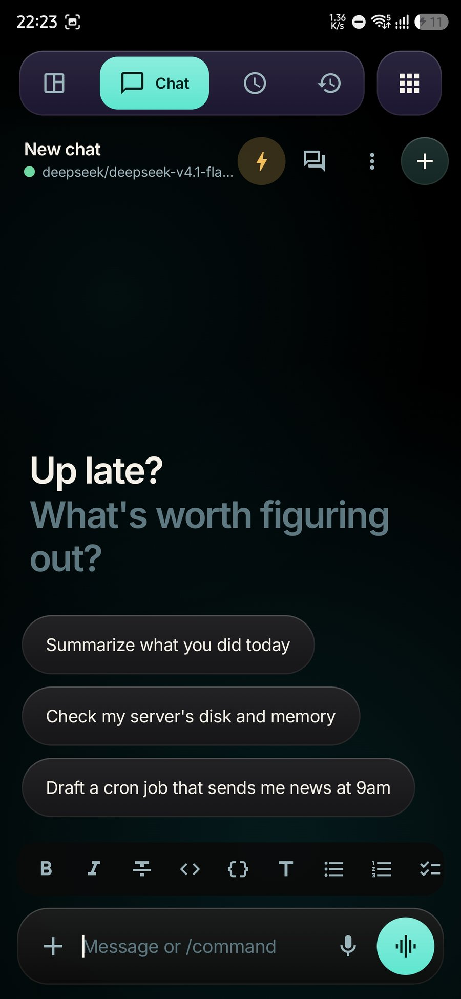

# Talaria

An independent Android client for Hermes Agent servers.

Version 1.14.12 (versionCode 29). Not affiliated with Nous Research.

## Screenshots

<table>
  <tr>
    <td></td>
    <td></td>
  </tr>
  <tr>
    <td></td>
    <td></td>
  </tr>
  <tr>
    <td></td>
    <td></td>
  </tr>
</table>

## Install

Download the signed APK from the [latest release](https://github.com/farhan-beg/talaria/releases/latest). Runs on Android 8.0 or newer.

## Features

- Chat with streaming replies, reasoning traces, and tool-call rendering
- Markdown composer with a formatting bar, live styling while you type, preview, and fully rendered messages
- Voice mode: dictate your turns, and have replies read in your phone's voice or through your server's TTS provider
- Session history with filters, mid-turn resume, and live reconnect over the Hermes gateway WebSocket
- Attachments, reactions, and a file browser
- Automations (scheduled prompts), webhooks, profiles, and channel management
- Admin panels: models, skills, keys, MCP servers, memory, logs, system, and analytics
- Sign-in with dashboard credentials and native token refresh; encrypted local storage
- Customizable look: palettes, glass effects, motion, and ambient background

## Build

Requires JDK 17 and an Android SDK (compileSdk 36, build-tools 35.0.0 or newer).

    ./gradlew :app:assembleRelease

The release build is unsigned unless a `keystore.properties` file is present.

## Status

Actively developed; releases are signed and built on CI. Installs via the Releases page, not Google Play.
